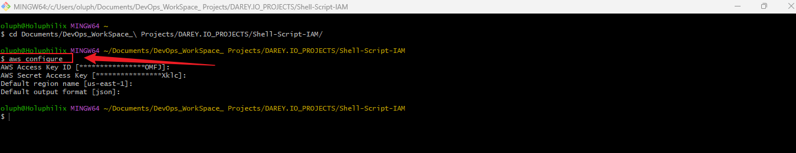
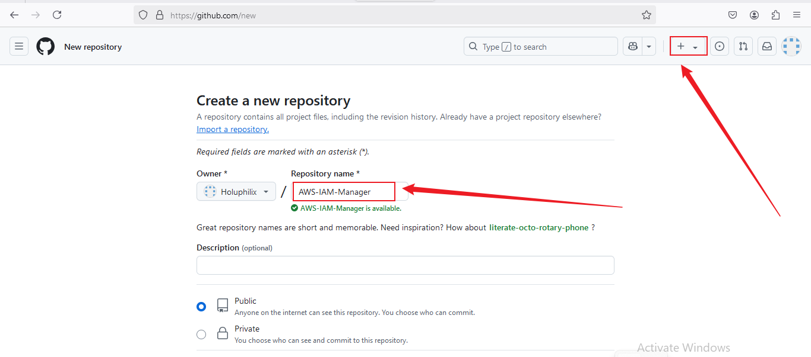

# Capstone Project: Shell Script for AWS IAM Management

## Introduction

This project, **Shell Script for AWS IAM Management**, showcases my ability to automate AWS Identity and Access Management (IAM) tasks using shell scripting. As part of my journey in learning DevOps and cloud automation, I developed this project to address a real-world use case of managing IAM resources efficiently.

CloudOps Solutions, a growing company, recently adopted AWS to manage its cloud infrastructure. To streamline operations and manage users effectively, the company decided to automate the process of creating IAM users, groups, and assigning permissions. This project extends the functionality of an existing script, `aws_cloud_manager.sh`, to fulfill these requirements.

## Project Objectives

The main objectives of this project are:

1. **Script Enhancement**: Extend the provided script to include IAM management functionalities.
2. **Define IAM User Names Array**: Store the names of five IAM users in an array for easy iteration during user creation.
3. **Create IAM Users**: Automate the creation of IAM users using AWS CLI.
4. **Create IAM Group**: Define a function to create an IAM group named `admin`.
5. **Attach Administrative Policy to Group**: Attach an AWS-managed policy (e.g., `AdministratorAccess`) to the `admin` group.
6. **Assign Users to Group**: Assign the IAM users to the `admin` group.

## Step-by-Step Approach

### Prerequisite

- Completion of foundational Linux knowledge with shell scripting mini projects.
- AWS CLI installed and configured with appropriate permissions.

### Tasks Breakdown

#### Task 1: Implement Version Control with Git
- Initialize Git Repository

- To begin, create the project directory named **Shell-Script-IAM**, navigate into it, and initialize it as a Git repository.

**Note:** For this project, I am using Git Bash on a Windows workstation to execute these shell commands, as it provides a Unix-like command-line experience.

**Commands:**
```bash
mkdir Shell-Script-IAM
cd Shell-Script-IAM
git init
```
  **Screenshots:** Project directory
 

#### Task 2: Script Enhancement
- Create a Bash script named `aws_cloud_manager.sh`. This script will handle IAM user and group management.

**Screenshots:** Create Bash Script aws_cloud_manager.sh


- Ensure the script can execute AWS CLI commands for user and group management.

For Windows:

- Download the AWS CLI MSI installer from the official AWS website.
- Run the installer and follow the on-screen instructions.

**Screenshots:** Install AWS CLI


- Verify the installation by opening Command Prompt and running:

**Screenshots:** Install AWS CLI


- After installation, configure AWS CLI by running:

**Screenshot:** AWS configure


#### Task 3: Define IAM User Names Array- Define an array to store five IAM user names
  
**Screenshot:** An array store five IAM user names:   


**Screenshot:** Make it executable:


**Screenshot:** Run the script:


#### Task 4. Create IAM Users
   - Iterate through the `iam_users` array and create IAM users using the following AWS CLI command:

**Screenshot:** The script to iterate through the iam_users array and create IAM users.


**Screenshot:** Execute the updated script:


#### Task 5. Create IAM Group
- Define a function in the script to create an IAM group named `admin`:

**Screenshot:** Add a function to create the admin group.


**Screenshot:** Run the script:


#### Task 6. Attach Administrative Policy to Group
- Attach the `AdministratorAccess` policy to the `admin` group:
  
**Screenshot:** Extend the script to attach the AdministratorAccess policy to the group:


**Screenshot:** Run the Script:


#### Task 7. Assign Users to Group
- Iterate through the `iam_users` array and add each user to the `admin` group:

**Screenshot:** Finally, add a section to assign the IAM users to the admin group:


**Screenshot:** Run the Script:


#### Task 8. Project Deliverables

#### Step 8.1: **Comprehensive Documentation**

 **Thought Process**

The primary goal of this project was to automate AWS Identity and Access Management (IAM) tasks using Bash scripting to ensure consistency, reduce manual effort, and avoid human errors. The key functionalities included creating IAM users, managing groups, and assigning policies.

To achieve these goals, I structured the script as follows:

1. **Planning**:
   - Define the requirements: Automate user creation, group management, and policy attachment.
   - Design a modular approach: Separate each task into functions for clarity and reusability.
   - Use an array to store IAM user names for scalability and easier management.

2. **Development**:
   - Script enhancement: Add IAM functionalities using AWS CLI commands.
   - Robust error handling: Ensure graceful handling of duplicate resources or missing permissions.
   - Logging: Add comments and outputs for easier debugging and understanding.

3. **Execution**:
   - Define an array for IAM user names.
   - Loop through the array to create users programmatically.
   - Create a group and attach the `AdministratorAccess` policy.
   - Add users to the group.


#### Step 8.2: **Challenges and Solutions**

1. **Challenge**: **Handling Duplicate User Creation**
   - **Problem**: If a user already exists, the script would fail with an error.
   - **Solution**: Add error handling using `if-else` blocks or conditional checks. Verify if the user exists before attempting to create them.

2. **Challenge**: **Permission Issues**
   - **Problem**: Insufficient AWS permissions caused failures in executing certain commands.
   - **Solution**: Use an AWS IAM role or a user with `AdministratorAccess` policy during testing and execution.

3. **Challenge**: **Debugging and Testing**
   - **Problem**: Debugging AWS CLI commands embedded in the script can be time-consuming.
   - **Solution**: Run individual commands on the CLI before adding them to the script. Add `set -x` for debugging during script execution.

4. **Challenge**: **IAM Policy ARN**
   - **Problem**: Using the wrong policy ARN would cause attachment failures.
   - **Solution**: Use the AWS CLI documentation to ensure the correct policy ARN is used (e.g., `arn:aws:iam::aws:policy/AdministratorAccess`).


#### Step 8.3: **Solutions Implemented in the Script**

1. **IAM User Creation**:
   - Used an array to store user names for iteration.
   - Added a loop to iterate through the array and create users using:
     ```bash
     aws iam create-user --user-name $user
     ```

2. **Group Management**:
   - Created a function to handle group creation and policy attachment:
     ```bash
     aws iam create-group --group-name admin
     aws iam attach-group-policy --group-name admin --policy-arn arn:aws:iam::aws:policy/AdministratorAccess
     ```

3. **Error Handling**:
- Checked if users or groups already existed before attempting creation:

```bash
if aws iam get-user --user-name $user 2>/dev/null; then
echo "User $user already exists."
else
aws iam create-user --user-name $user
fi
```

4. **Logging and Outputs**:
   - Added `echo` statements for each step to provide real-time feedback.

#### Step 8.4: **Script Highlights**

- **Modularity**: Divided the script into reusable functions for creating users, groups, and attaching policies.
- **Scalability**: Using an array allows easy addition or removal of users.
- **Efficiency**: Automating repetitive tasks saves time and minimizes errors.
- **Transparency**: Clear logging and outputs help track script progress.

#### Task 9. **Uploading the Script to GitHub and Linking for Remote Execution**

#### **Steps to Upload My Script to GitHub**

**step 9.1: Stage and Commit the Template to Git**

In this step, I will add the website files to the Git repository, configure my global Git settings, and make an initial commit with a descriptive message.

- Add Files: Add all website files to the staging area.

- Configure Git User Information: Set up global configuration with my actual git username and email address.

- Commit Changes: Commit the changes with a clear and descriptive message.

Commands:
git add .
git config --global user.name "holuphilix"
git config --global user.email "oluphilix@gmail.com"
git commit -m "Initial commit: AWS IAM Manager script for automating user, group, and policy management"

**Screenshot:** Git Add and Git Config


**Step 9.2: Push the code to your Github repository**

After initializing your Git repository and adding your `AWS-IAM-Manager.sh`, the next step is to push your code to a remote repository on GitHub. This step is crucial for version control and collaboration.

- Create a Remote Repository on GitHub: Log into your GitHub account and create a new repository named `AWS-IAM-Manager`. Leave the repository empty without initializing it with a README, .gitignore, or license.

**Screenshots:** creation of Git Repository



- Link Your Local Repository to GitHub: In your terminal, within your project directory, add the remote repository URL to your local repository configuration.

- Push Your Code: Upload Your Local Repository Content to GitHub Once you have linked your local repository to GitHub, use the following command to push your commits from your local main branch to the remote repository. This enables you to store your project in the cloud and share it with others.

**Commands:**
 ```bash
git remote add origin https://github.com/Holuphilix/AWS-IAM-Manager.git
git branch -M main
git push -u origin main
```
***Screenshot:** Git Push to origin Main


**Step 9.3: Share My GitHub Repository Link**:
- Once uploaded, I shared my repository link:  

 ```bash
https://github.com/holuphilix/AWS-IAM-Manager
```

#### Benefits of Hosting the Script on GitHub
- **Version Control:** Allows tracking changes and rolling back if needed.
- **Collaboration:** Facilitates contributions from other team members or collaborators.
- **Accessibility:** Provides a central location for accessing and downloading the script.
- **Documentation:** GitHub’s README file can serve as a detailed guide for usage and configuratio